# Automatic Electric Meter Reader

## Introduction

Electricity is vital, and accurate meter readings are imperative. Despite smart meters in developed regions, manual readings persist in many areas, introducing errors. Aim of this project is to provide a automated method for taking meter reading. The core foundation of the project is a custom Convolutional Neural Network (CNN) classifier designed for the unique challenge of recognizing digits on seven-segment display of electric meter.

While Optical Character Recognition (OCR) tools like Google Tesseract excel at recognizing digits, their accuracy diminishes when faced with the unique challenge of seven-segment displays. These displays feature digits segmented with gaps and possess distinct structures, making traditional OCRs less effective. To overcome this, we have developed a Convolutional Neural Network (CNN) model, known for its prowess in feature extraction and classification. Trained on a custom build dataset, our CNN model proves effective and computationally efficient in recognizing digits on seven-segment displays with proven 90 percent accurary on training dataset.

In essence, the project involves uploading a video of meter readings, applying preprocessing techniques, and utilizing our trained CNN model to recognize electricity usage. Simultaneously, the meter number is identified using Google Tesseract. The results are then presented to the user and stored in a database, streamlining the meter reading process. Further details on these processes are outlined in the methodology section


## Methodology

Our proposed system comprises two primary stages. In the initial stage, a series of preprocessing techniques enhance image clarity, focusing on extracting and segmenting the LCD and meter number portions of the electric meter. The subsequent stage involves the design and implementation of a CNN trained on a collected dataset. This CNN learns to classify images into digit classes. Further details on each stage and the techniques employed are outlined below. Refer to Figure 1 for a general overview of the entire system.

<p align="center">
  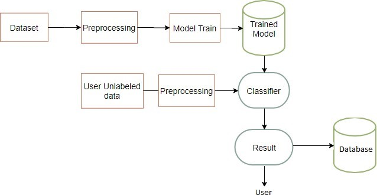
   <figcaption style="text-align: center"> Fig.1 - System Overview.</figcaption>
</p>

### Preprocessing Stage:
following preprocessing techniques were applied 

#### Image alignment
Feature-based alignment uses Oriented Fast and Rotated BRIEF (ORB) for feature detection and descriptor computation. Features from the sample and new images are matched based on Hamming distance. Out of 600 matches, only 0.1 percent good matches are retained using Random Sample Consensus (RANSAC) based homography. The calculated homography aligns the new image with the sample image, as depicted in Figure 2.


<p align="center">
  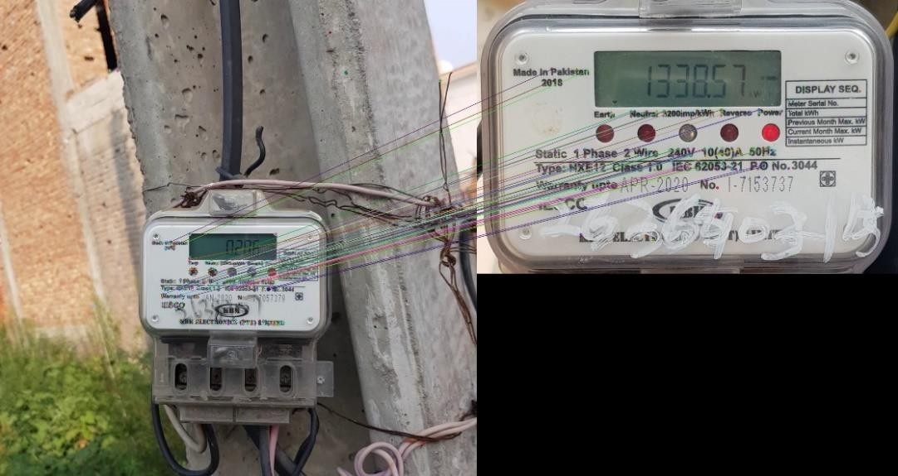
   <figcaption style="text-align: center"> Fig.2 - Image Alignment.</figcaption>
</p>

#### Extracting area of interest
The meter image has two key areas: the LCD for electricity reading and the meter number section. For LCD extraction, edge detection is applied, and the largest rectangle is identified. This consistent process, aided by image alignment, allows for precise segmentation. The meter number section is extracted using predefined coordinates.

<p align="center">
  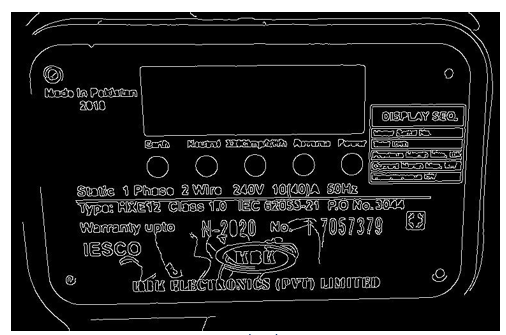
   <figcaption style="text-align: center"> Fig.3 - Edge detectiont.</figcaption>
</p>

<p align="center">
  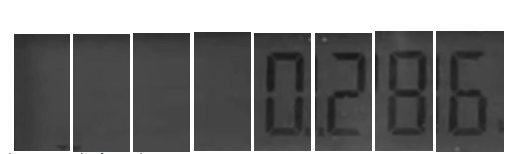
   <figcaption style="text-align: center"> Fig.4 - segmentation of LCD.</figcaption>
</p>

#### Morphological transformations
Following area extraction, the next step involves enhancing number visibility. For the segmented LCD portion, Gaussian Blur, Otsu's Binarization, and dilation are applied. This preprocessed data is then classified using the trained model. For the meter number section, adaptive thresholding, opening, and dilation are applied to enhance text visibility, followed by number recognition using Tesseract.

<p align="center">
  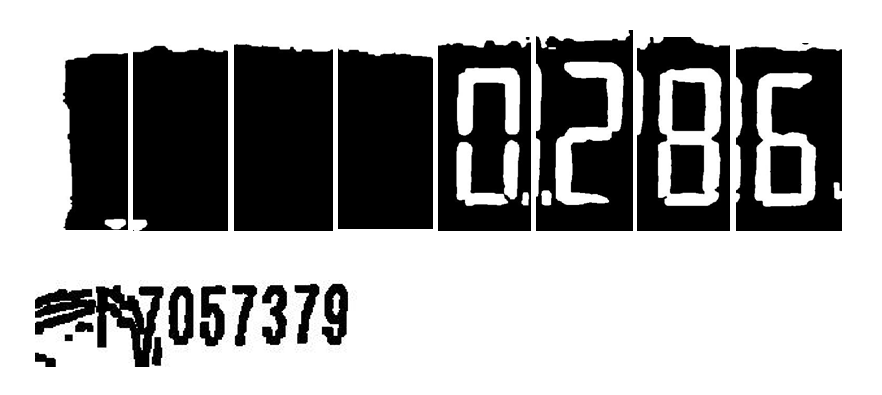
   <figcaption style="text-align: center"> Fig.4 - After pre processing.</figcaption>
</p>

### CNN model training
The dataset, consisting of 1433 images, undergoes resizing to 50x50 grayscale, prioritizing measures against overfitting. Splitting into 90% training and 10% testing, with 10% for validation, ensures robust model evaluation.

The convolutional network, inspired by LeNet-1, features two sets of layers. The first set comprises a 32-filter convolutional layer with a 3x3 kernel, followed by a ReLU activation. Subsequent max-pooling uses a 2x2 size and a stride of 1. The second set mirrors the first.

Initial training for 1000 epochs shows overfitting, prompting a 600-epoch retrain for 96% training and 92% validation accuracy. Attempts to enhance complexity with an additional convolutional layer lead to overfitting. The decision to retain the two-layer model yields the highest validation accuracy at 92%, with testing confirming 90% accuracy.
<br><br><br>


<p align="center">
  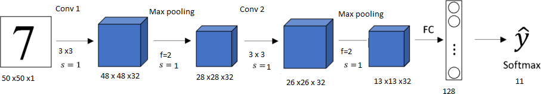
   <figcaption style="text-align: center"> Fig.4 - Network Architecture.</figcaption>
</p>
<br>

<p align="center">
  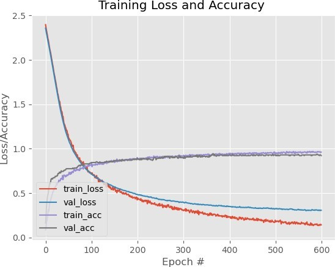
   <figcaption style="text-align: center"> Fig.4 - Network Architecture.</figcaption>
</p>

## Prerequisites

Before running the Python application, ensure that your system meets the following requirements:

### 1. Python Version

- Python 3.7.8 is required.
- You can download Python from the [official Python website](https://www.python.org/downloads/release).

### 2. Tesseract OCR

- Tesseract OCR version 5.0.0-alpha.20201127 is required.
- Installation instructions for Tesseract OCR can be found on the [Tesseract GitHub repository](https://github.com/tesseract-ocr/tesseract).

### 3. MongoDB

- MongoDB version 4.4 is required.
- Install MongoDB by following the instructions on the [MongoDB Download Center](https://www.mongodb.com/try/download/community).

### 4. Python Packages

Ensure that the required Python packages are installed. You can install them using the provided `requirements.txt` file. Use the following command:

```bash
    pip install -r requirements.txt
```


## GUI 
**GUI Functionality Overview:**

- **Startup Window (Figure 14):**
  - User greeted with the main application window.
  - Result section shows "NA," and the start button is yellow, indicating readiness.

<p align="center">
  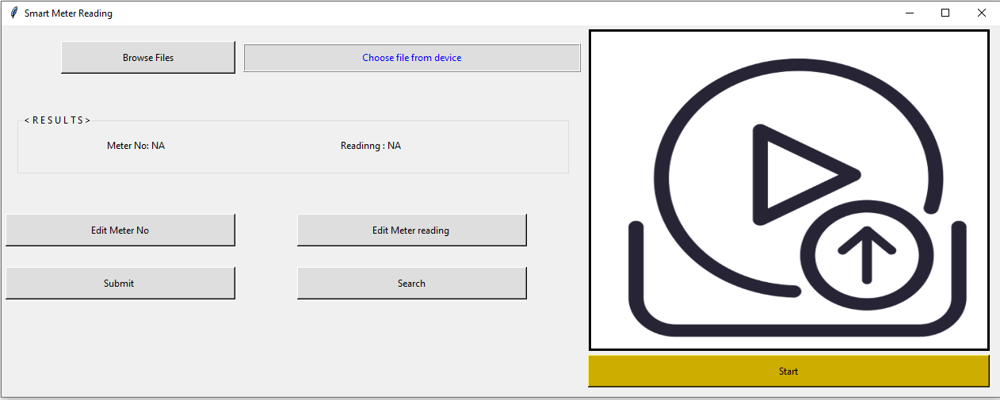
   <figcaption style="text-align: center"> Fig.4 - Startup_window.</figcaption>
</p>

- **Selecting File (Figure 15):**
  - Use "Browse File" to select a video file.
  - File path displayed, and the first frame is shown.
  - Start button turns green, signifying readiness to process.

<p align="center">
  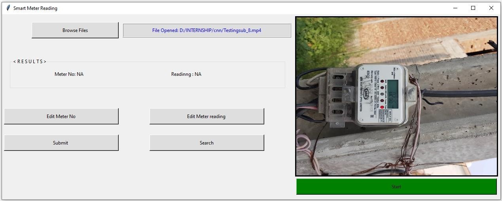
   <figcaption style="text-align: center"> Fig.4 - Startup_window.</figcaption>
</p>

- **Waiting State (Figure 16):**
  - Pressing start initiates processing.
  - Start button text changes to "Processing," and color turns red.
  - A processing logo appears on the file image.

<p align="center">
  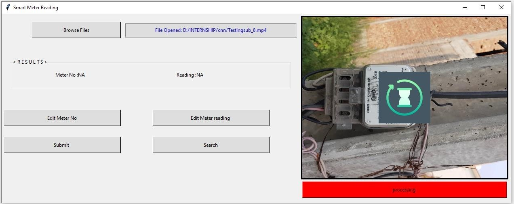
   <figcaption style="text-align: center"> Fig.4 - Startup_window.</figcaption>
</p>

- **Showing Output (Figure 17):**
  - After processing, a visual image of the meter is displayed.
  - Detected LCD and recognized digits are shown.
  - Recognized reading and meter number displayed in the results section.

<p align="center">
  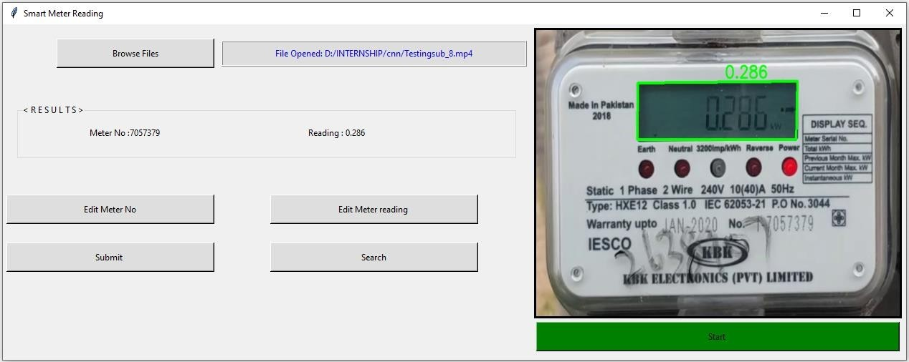
   <figcaption style="text-align: center"> Fig.4 - Startup_window.</figcaption>
</p>

- **Editing Result (Figure 18):**
  - After processing, users can edit meter number or reading.
  - Clicking "Edit" opens a pop-up to input new values.

<p align="center">
  
   <figcaption style="text-align: center"> Fig.4 - Startup_window.</figcaption>
</p>

- **Storing Result in Database (Figure 19):**
  - Users can store results in the database by clicking "Submit."

<p align="center">
  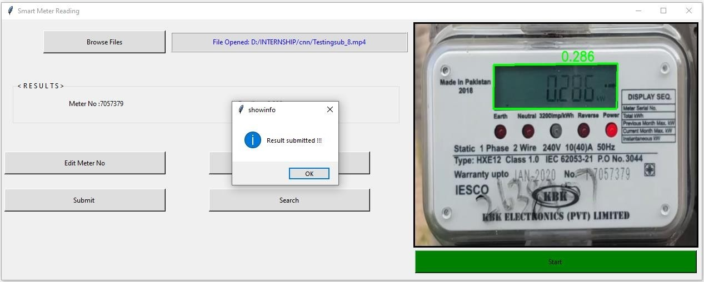
   <figcaption style="text-align: center"> Fig.4 - Startup_window.</figcaption>
</p>

- **Searching Database:**
  - Functionality allows users to search for previous results.
  - Entering a meter number displays all readings associated with it.

<p align="center">
  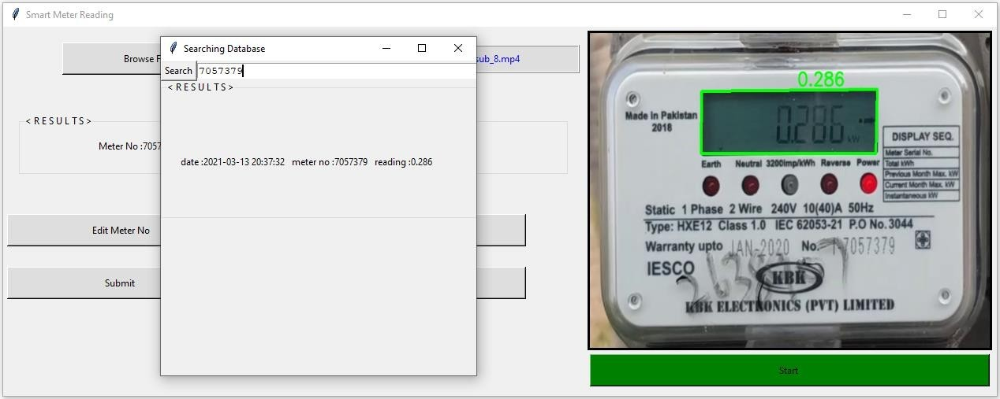
   <figcaption style="text-align: center"> Fig.4 - Startup_window.</figcaption>
</p>

## License

This project is licensed under [GPL](LICENSE). Please refer to the LICENSE file for specific licensing details.
